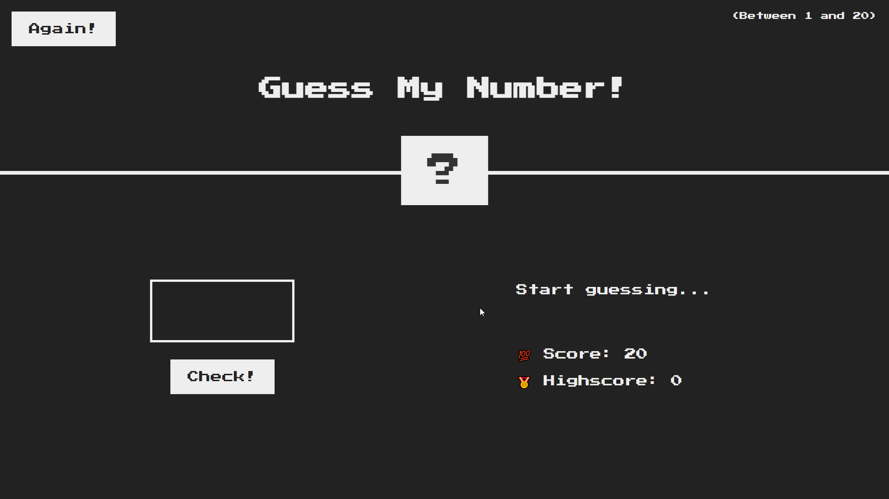
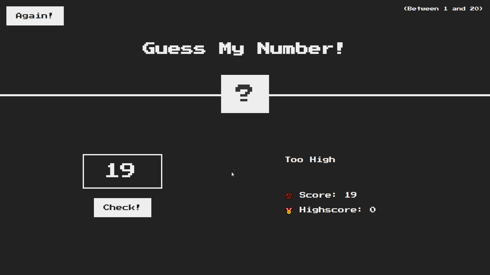
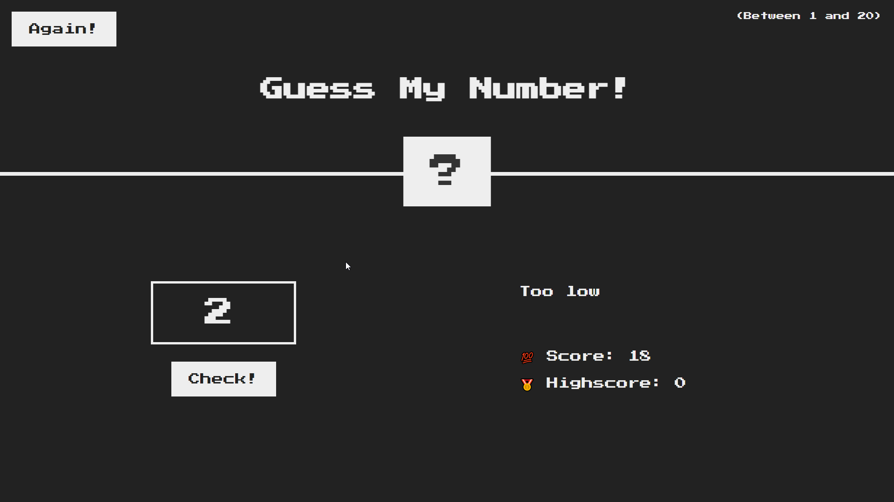
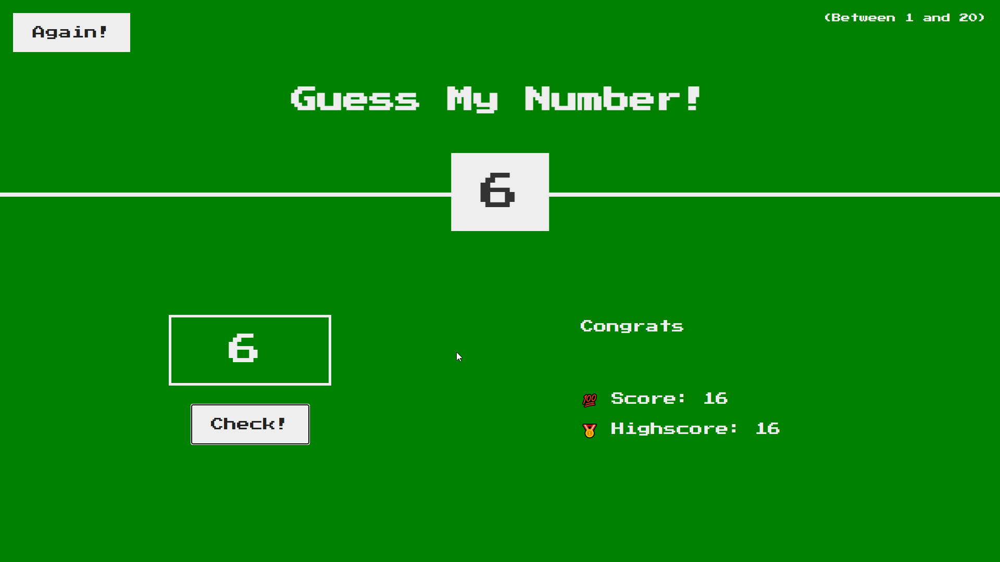

# Guess The Number - JavaScript Game
(Please wait for screenshots to load thank you :) )

A pratice project made while learning Javascript
This game usally implies the player to guess a number along with the following rules:

Rule 1 : The secreat number will be generated randomly using the Math.Random()  
Rule 2 : The player can take the hint on right if procided number is high or low  
Rule 3 : The player needs to guess the number with least chances to score more.

Note : The number range is set to 0-20, however can be chnaged to other range from SC.

This Project is build using :
JavaScript
(The frontEnd was taken online)

Below are the screenshot for the project

The Number is High

The Number is Low

Player Wins...!

